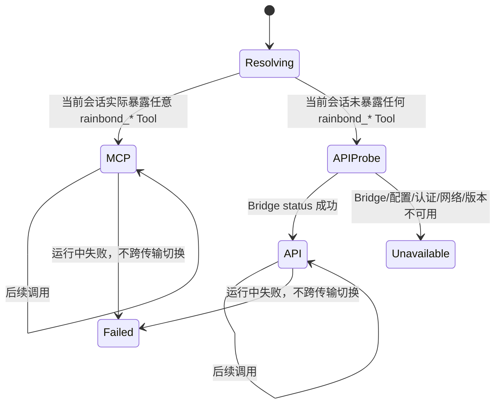

# Rainskills MCP 优先、API 备用传输设计文档

> 状态：待评审，尚未实施
>
> 日期：2026-08-12，风险修订：2026-08-13
>
> 涉及仓库：`rainskills`、`rainbond-console`
> 原则：单一能力源、MCP 优先、按需发现、工作流内不切换、不建设第二套业务 API。

## 一、项目背景

### 1.1 项目架构

Rainskills 通过独立 Skill 编排 Rainbond MCP Tool。Rainbond Console 已在 Django 内实现 Streamable HTTP MCP，实际业务入口集中在 `MCPQueryService.list_tools()` 与 `call_tool()`。

### 1.2 现有基础

- 支持 MCP 的客户端可在会话启动时注册全部 `rainbond_*` Tool。
- Console 已允许携带 JWT 后，无 `initialize`、无客户端 Session 直接调用 `tools/list` 和 `tools/call`。
- Rainskills 安装器已经安全保存 Console URL 与 JWT 到 `~/.rainbond/mcp.env`。
- Console 的 Rainskills 专用入口已经承担客户端标识、工具发现过滤和部署遥测。

### 1.3 核心需求

当客户端无法安装或加载 MCP 时，仍可通过一个轻量本地 Bridge 调用同一批 Tool；能够使用 MCP 时继续优先使用 MCP。备用路径必须自动跟随 Tool 增删，限制模型上下文体积，并避免写操作跨传输重复执行。

## 二、整体架构设计

### 2.1 系统架构图

```text
Skill
  -> 当前会话存在所需 rainbond_* Tool -> 原生 MCP
  -> 否则 ~/.rainbond/bin/rainskills-tools.js -> HTTP JSON-RPC

MCPQueryHTTPView / Rainskills API Bridge
  -> MCPQueryService.list_tools / call_tool
  -> Console services / repositories / Region API
```

### 2.2 核心流程

1. Skill 在第一次 Rainbond 调用前选择传输。
2. 当前会话暴露任意 `rainbond_*` Tool 时使用 MCP；所需 Tool 缺失按版本或可见性错误处理。
3. 只有会话没有暴露任何 `rainbond_*` Tool 时运行 Bridge 的 `status`；成功后将本次工作流锁定为 API。
4. Bridge 通过 Rainskills 专用 HTTP 路径调用 `tools/list`/`tools/call`，不维护第二份能力目录。
5. `describe` 在本地从实时 `tools/list` 结果中只返回单个 Schema；`call` 只输出 `structuredContent`。
6. 认证、网络或业务失败不触发传输切换；写操作结果未知时先读取平台事实。

## 三、数据模型设计

### 3.1 新增数据库表

不新增数据库表。

### 3.2 数据关系

不新增持久化领域对象。Bridge 只读取 `RAINBOND_URL`、`RAINBOND_JWT` 或 `~/.rainbond/mcp.env`。Tool 目录始终以 Console 实时 `list_tools()` 为准，不建立本地长期缓存。

## 四、API设计

### 4.1 接口列表

不新增 REST API。新增一个与现有客户端专用入口等价的 Rainskills API Bridge 标识路由：

```text
POST /console/mcp/rainskills/api/query
```

请求协议继续使用现有 JSON-RPC：

- `tools/list`
- `tools/call`

### 4.2 请求/响应结构

Bridge 命令：

```text
rainskills tools status
rainskills tools list [--prefix <prefix>]
rainskills tools describe <tool-name>
rainskills tools call <tool-name> --input <json-file|->
```

- Token 只能来自环境或受保护配置文件，不能通过命令行参数传递。
- `list` 默认只输出名称；`describe` 只输出一个工具定义。
- `call` 成功只输出 `structuredContent`，失败输出结构化错误并返回非零退出码。

## 五、核心实现设计

### 5.1 关键逻辑

- Console 在 Tool 执行阶段再次应用 Rainskills 可见性策略，禁止“发现时隐藏、知道名称后仍可调用”。
- Bridge 直接使用 Tool 名称，不增加 Capability ID 映射。
- Bridge 每次 `describe` 实时查询目录，使新增、修改、删除自动生效。
- Skill 选择逻辑只有 MCP、API、不可用三个结果，不提供运行中自动容灾。
- Bridge 不输出完整 MCP `content` 包装，降低模型 Token 消耗。

### 5.2 复用现有代码

- 复用 `MCPQueryHTTPView` 的认证、错误契约和无 Session 调用。
- 复用 `MCPQueryService.list_tools()` 与 `call_tool()`。
- 复用安装器生成的 `~/.rainbond/mcp.env`。
- 复用所有现有 Skill 的 Tool 名称和工作流语义。

## 六、实施计划

### Sprint 1: Console 执行边界

#### Task 1.1: 增加 API Bridge 专用 MCP 路由
- 文件：`rainbond-console/console/urls/__init__.py:207`
- 实现内容：新增 `deploy_origin=rainskills`、`deploy_client=api` 的 HTTP MCP 路由。
- 验收标准：URL 解析与 invocation context 测试通过。

#### Task 1.2: 执行阶段强制 Tool 可见性
- 文件：`rainbond-console/console/services/mcp_query_service.py:371`
- 实现内容：Rainskills invocation 调用隐藏 Tool 时返回 404。
- 验收标准：隐藏工具既不可发现也不可直接调用；通用 MCP 行为不变。

### Sprint 2: 本地 API Bridge

#### Task 2.1: 实现无状态 Tool Bridge
- 文件：`rainskills/bin/rainskills-tools.js`
- 实现内容：实现 `status/list/describe/call`、安全配置读取、超时和结构化错误。
- 验收标准：Node 单元测试覆盖配置、目录裁剪、调用成功和失败。

#### Task 2.2: 集成启动器与安装器
- 文件：`rainskills/bin/rainskills.js:19`
- 文件：`rainskills/install.sh:2413`
- 文件：`rainskills/rainbond-platform-installer/scripts/windows-onboarding.js:458`
- 实现内容：支持 `rainskills tools ...`，并把 Bridge 安装到用户私有 `.rainbond/bin`。
- 验收标准：POSIX、Windows 和 npm 包测试通过。

### Sprint 3: Skill 自动选路

#### Task 3.1: 增加共享传输规则
- 文件：`rainskills/rainbond-app-assistant/references/transport-resolution.md`
- 文件：所有会调用 Rainbond Tool 的 `rainbond-*/SKILL.md`
- 实现内容：复用官方完整套件安装保证，维护一份共享规则；原生 MCP 优先；缺失时 Bridge；首次调用前锁定；失败不切换。
- 验收标准：安装布局检查和路由评测确认所有业务 Skill 的相对引用可解析并使用同一规则。

## 七、关键参考代码

| 功能 | 文件 | 说明 |
|------|------|------|
| MCP HTTP 分发 | `rainbond-console/console/views/mcp_query.py` | 已支持认证后的无 Session JSON-RPC |
| Tool 注册与执行 | `rainbond-console/console/services/mcp_query_service.py` | 唯一能力来源 |
| Rainskills 路由 | `rainbond-console/console/urls/__init__.py` | 固定 invocation origin/client |
| npm 启动器 | `rainskills/bin/rainskills.js` | 子命令跨平台路由 |
| POSIX 安装器 | `rainskills/install.sh` | Skill、认证和客户端配置 |
| Windows 安装器 | `rainskills/rainbond-platform-installer/scripts/windows-onboarding.js` | Native Windows 安装路径 |

## 八、详细架构决策

### 8.1 这不是第二套 Tool 平台

“API 备用传输”只描述客户端如何发起请求，线上协议仍是 Console 已实现的 MCP JSON-RPC。目录和执行始终只有一份：

```text
MCP native client ─┐
                   ├─> MCPQueryHTTPView ─> list_tools / call_tool
Local API Bridge ──┘
```

因此本期明确不做：逐 Tool REST Endpoint、OpenAPI 转换层、Capability ID 映射、本地 Tool 注册表、Catalog 同步服务和数据库表。

### 8.2 客户端适配边界

| 客户端能力 | 可用传输 | 本期处理 |
|---|---|---|
| 能加载远程 MCP | 原生 MCP | 首选，行为不变 |
| 不能加载 MCP，但能执行 Node/Shell | API Bridge | 本期支持 |
| 不能加载 MCP/本地命令，但能声明 HTTP Function | 客户端 HTTP Adapter | 后续按客户端单独适配 |
| 上述能力均没有 | 无 | 明确停止，Skill 不能凭空产生执行能力 |

这避免把“适配所有 AI 应用”变成一个无法验证的承诺。本期实际覆盖的是有本地命令执行能力、但 MCP 安装或加载困难的客户端。

### 8.3 传输状态机

传输只在本次工作流第一次 Rainbond 调用前解析一次：



判定依据是“当前会话是否实际暴露任意 Rainbond Tool”，而不是磁盘上是否存在 MCP 配置。只要已加载 Rainbond MCP，就锁定 MCP；单个 Tool 缺失不能借 API 绕过可见性。安装后未重启且完全没有 Rainbond Tool 的旧会话才会进入 API 探测。

认证、网络、参数和业务错误都不触发自动切换。尤其是写操作在超时后不得通过另一传输重试；必须先调用读取类 Tool 确认平台真实状态。

### 8.4 能力发现与自动同步

API 本身不会自动注册成模型 Tool，因此 Bridge 提供四个小命令：

```text
node ~/.rainbond/bin/rainskills-tools.js status
node ~/.rainbond/bin/rainskills-tools.js list [--prefix <prefix>]
node ~/.rainbond/bin/rainskills-tools.js describe <tool-name>
node ~/.rainbond/bin/rainskills-tools.js call <tool-name> --input <json-file|->
```

使用原则：

- Skill 已明确稳定 Tool 名称时可直接 `call`；参数校验失败再 `describe` 一次。
- 新能力探索先 `list --prefix`，再只 `describe` 一个候选 Tool。
- 同一工作流对同一个 Tool 最多加载一次 Schema，不做磁盘缓存。

自动同步边界如下：

| Console 变化 | Bridge 的自动行为 | 是否需要更新 Skill |
|---|---|---|
| 新增 Tool | 下一次 `list/describe` 立即可见 | 传输层不需要；新工作流语义需要 |
| 修改 Schema | 下一次 `describe` 得到新 Schema | 语义兼容则不需要，否则需要 |
| 删除 Tool | `describe/call` 明确报不存在 | 引用了该 Tool 的 Skill 需要 |
| 修改权限 | Console 立即生效 | 不需要 |

Bridge 自动同步的是接口契约，不可能自动理解新 Tool 应如何嵌入部署、排障或回滚工作流。工作流语义仍由 Skill 版本管理。

### 8.5 Token 优化

不能笼统判断 API 一定比 MCP 更费 Token。原生 MCP 往往在会话开始加载完整 Tool Schema；API 多一次命令交互，但能够按需加载。成本取决于客户端的上下文注入方式。

本方案设置以下硬约束：

1. `status` 只输出状态和 Tool 数量。
2. `list` 只输出名称，不输出描述和 Schema。
3. `--prefix` 缩小候选集合。
4. `describe` 一次只返回一个 Tool。
5. `call` 只输出 `structuredContent`，不重复输出 `content[].text`。
6. Skill 不复制完整 Tool Catalog。
7. 同一 Tool 的 Schema 在单次工作流中最多查询一次。
8. 大日志继续使用 Tool 已有的分页和裁剪参数。

验收时不虚构特定模型 Token 数，而是比较可复现的序列化体积：

```text
full_catalog_bytes
compact_list_bytes
one_tool_schema_bytes
structured_call_result_bytes
```

在当前 Tool Catalog 上记录 `compact list + 5 个平均 Schema` 相对完整 Catalog 的字节比例，作为发布证据。

### 8.6 安装交付

采用稳定本地文件，不依赖每次运行 `npx`：

```text
~/.rainbond/
  mcp.env
  bin/
    rainskills-tools.js
```

- `mcp.env` 保持现有 0600/Windows 受限 ACL。
- Bridge 使用 Node 内置模块，无生产依赖；POSIX 设为私有可执行权限，Windows 复用安全目录策略。
- 正常安装、更新和 `--force` 原子替换 Bridge。
- `refresh` 只更新 JWT，不改 Bridge。
- 默认安装继续要求原生 MCP 注册和验证成功；Bridge 可用不能掩盖默认 MCP 安装失败。
- 新增正交的显式 `--api-only` 安装标志：安装 Skills 和 Bridge、完成授权、验证 API 专用入口，但不修改客户端 MCP 配置；继续复用现有 `codex|claude|all|--dest` 目标选择。
- `--custom-dest` 和 `--skip-mcp` 保持历史“只复制 Skill”语义，不承诺 API fallback，不能作为 `api` 模式别名。
- 没有 Node.js 18+ 时仍可安装原生 MCP Skills，但不支持 API Bridge；本期不增加 Python/Shell Bridge。
- `npx rainskills tools ...` 只作为诊断入口，Skill 的正常运行使用稳定安装路径。

### 8.7 API 契约

新增固定标识路由，但不新增 View 和业务 Handler：

```text
POST /console/mcp/rainskills/api/query
deploy_origin = rainskills
deploy_client = api
```

请求：

```http
Authorization: GRJWT <jwt>
Content-Type: application/json
Accept: application/json
MCP-Protocol-Version: 2025-03-26
```

只使用 `tools/list` 和 `tools/call`。已认证请求复用 Console 当前的无 `initialize`、无客户端 Session 调用能力。Bridge 不使用 SSE、GET 长连接或 DELETE Session。

配置优先级：进程环境 `RAINBOND_URL/RAINBOND_JWT` 高于 `~/.rainbond/mcp.env`。Bridge 只解析这两个键，不执行配置文件中的 Shell；不支持 `--token`、Query Token 或 Body Token。

成功 `call` 必须存在 `structuredContent`；缺失时视为协议不兼容，不能静默把冗余 MCP 文本塞入上下文。

建议的稳定退出码：

| 退出码 | 含义 |
|---|---|
| 0 | 成功 |
| 2 | 命令或输入错误 |
| 3 | 配置或认证错误 |
| 4 | 网络、超时、Endpoint 或协议错误 |
| 5 | Tool 不存在、参数校验或业务错误 |

请求固定超时为 180 秒。它必须大于 Console 当前最长 120 秒同步等待窗口并留出网络响应余量；Bridge 本身不自动重试。

### 8.8 安全边界

本期必须修复：

- Rainskills 隐藏 Tool 不仅从 `tools/list` 过滤，在执行阶段也必须返回 404。
- 专用 API 路由 404 时不回退通用 `/console/mcp/query`，避免改变隐藏策略和遥测语义。
- JWT 只能来自环境或受保护文件，日志和错误不得包含 Authorization、JWT 或完整 arguments。
- 客户端选路只能决定传输，不能决定授权；用户、企业、团队、应用和组件权限继续由 Console 判断。

本期不做新 JWT Scope、Audience 迁移或全面移除 MCP 的 Cookie/Query/Body Token 兼容。这些改动会影响所有现有 MCP 客户端，应单独设计。API Bridge 自身只使用 Authorization Header，不扩大认证输入面。

### 8.9 失败处理

| 失败 | 是否切换 | 恢复动作 |
|---|---|---|
| 参数或业务错误 | 否 | 修正参数或停止 |
| 401/403 | 否 | 复用现有 JWT refresh 流程 |
| API Endpoint 404 | 否 | 提示升级 Console |
| 读请求网络失败 | 否 | 可在同一传输有限重试 |
| 写请求超时/结果未知 | 否 | 先查平台事实，确认未执行后再决定 |
| MCP 工作流中途失效 | 否 | 停止，不自动改走 API |

### 8.10 兼容矩阵

| 组合 | 原生 MCP | API fallback |
|---|---|---|
| 新 Rainskills + 新 Console | 支持 | 支持 |
| 旧 Rainskills + 新 Console | 支持，行为不变 | 不提供 |
| 新 Rainskills + 旧 Console | 支持旧 MCP | status 明确要求升级 Console |
| 旧 Rainskills + 旧 Console | 行为不变 | 不提供 |

发布顺序必须是先 Console、后 Rainskills。回滚 Rainskills 后 Skill 不再选 API；即使 Bridge 文件仍存在也不会被调用。没有数据库迁移和数据回滚。

## 九、完整实施与验证门禁

### 9.1 Sprint 0：评审与基线

- 冻结 Endpoint、Header、JSON-RPC 方法、结果、错误、退出码、版本矩阵和非目标。
- 分别运行两仓基线测试并记录既有失败。
- 设计批准前不进入代码阶段。

### 9.2 Sprint 1：Console 执行边界

1. 先写 URL 解析失败测试，再增加 `api` 专用路由。
2. 先写隐藏 Tool 直接调用失败测试，再在执行阶段复用同一隐藏集合。
3. 增加通用 MCP 仍可调用服务器本机 Tool 的回归测试。
4. 验证已认证、无 Session 的 `tools/list/call` 不被改变。

### 9.3 Sprint 2：Bridge

1. 参数解析：覆盖四个命令、必填参数、未知参数和 `--token` 拒绝。
2. 配置解析：覆盖环境优先、受限 `mcp.env`、URL 规范化、协议拒绝和 Secret 脱敏。
3. HTTP：覆盖 Header、JSON-RPC、超时、非 2xx、坏 JSON 和 JSON-RPC error。
4. Catalog：覆盖 compact list、prefix、单 Tool describe 和删除 Tool。
5. Call：覆盖 `structuredContent`、`isError`、缺少结构化结果和退出码。
6. Launcher/Package：覆盖 `rainskills tools` 路由及 npm packed artifact。
7. 记录 Catalog 体积基准。

### 9.4 Sprint 3：安装与 Skill 适配

1. POSIX：首次安装、更新、force、skip-mcp、custom-dest、显式 `--api-only`、权限和失败清理。
2. Windows：Native Windows、WSL 控制、ACL、重解析点和路径逃逸。
3. 在 `rainbond-app-assistant/references/` 新增唯一 `transport-resolution.md`；其余业务 Skill 使用一个相对引用，安装测试保证完整套件布局。
4. 重写顶层 `rainbond-app-assistant` 的 MCP-only Preflight；八个业务 Skill 使用统一短入口，根安装 Skill 与平台安装 Skill 不引用。
5. 静态和路由评测校验规则没有遗漏，且 MCP 存在但 401/超时时不会切换 API。
6. 具体 Skill 文案以 `docs/plans/2026-08-13-skill-transport-contract.md` 为准。

### 9.5 Sprint 4：跨仓与端到端

测试矩阵：

| 场景 | 预期 |
|---|---|
| 当前会话有任意 MCP Tool | 不运行 Bridge；单 Tool 缺失按 MCP 版本/可见性错误处理 |
| MCP 缺失、Bridge 可用 | 工作流锁定 API |
| MCP/Bridge 都不可用 | 停止并报告缺失条件 |
| API Token 过期 | refresh 后同传输恢复 |
| API 路由 404 | 提示升级，不回退通用路由 |
| Tool 新增/修改/删除 | 下一次 list/describe 反映变化 |
| 写操作服务端完成但客户端超时 | 不跨传输重试，先读取确认 |
| 隐藏 Tool 知道名称后直接调用 | Rainskills 路径返回 404 |

验证命令：

```text
# rainbond-console
pytest console/tests/mcp_deployment_invocation_test.py \
       console/tests/mcp_query_view_test.py \
       console/tests/mcp_query_service_test.py \
       console/tests/mcp_query_error_contract_test.py -q
make format
make check
pytest

# rainskills
node --test tests/api-bridge.test.js \
                 tests/npx-launcher.test.js \
                 tests/transport-resolution.test.js
npm run test:package
npm run test:installer
npm run test:windows
npm test
```

### 9.6 提交分组

| 顺序 | 仓库 | Commit | 范围 |
|---|---|---|---|
| 1 | rainbond-console | `fix: enforce rainskills tool visibility` | 专用路由、执行保护、测试 |
| 2 | rainskills | `feat: add api fallback bridge` | Bridge、Launcher、协议测试、体积基准 |
| 3 | rainskills | `feat: install api fallback transport` | POSIX/Windows 安装、共享选路规则、测试 |

每组提交前运行相关测试；全部完成后运行全量门禁和跨仓兼容检查。计划文档不与业务代码混入同一提交。

### 9.7 完成定义

- MCP 可用时无额外 Bridge 调用。
- API 模式不把完整 Catalog 常驻上下文。
- Tool 目录和执行器没有第二份事实源。
- Tool 增删改能被下一次 `list/describe` 感知。
- 写操作不会自动跨传输重试。
- API 与 MCP 使用相同服务端权限。
- 新旧版本行为有自动测试。
- 两仓全量验证通过并保存证据。

## 十、风险与非目标

| 风险 | 影响 | 控制措施 |
|---|---|---|
| 客户端不能执行本地命令 | API fallback 不可用 | 明确边界，后续增加专用 HTTP Adapter |
| 旧 Console 无专用路由 | status 失败 | 清晰升级提示，不静默降级 |
| Tool Schema 破坏性变化 | Skill 调用失败 | 按需 describe、结构化错误、契约测试 |
| 写操作超时后重复执行 | 资源重复或误删除 | 工作流锁定、先查平台事实 |
| Catalog 增加 Token | 上下文压力 | 紧凑 list、单 Tool describe、call 去重 |
| Bridge 泄漏 JWT | 高安全影响 | 禁止 CLI Token、受限解析、脱敏测试、私有权限 |
| Skill 规则漂移 | 选路不一致 | 单共享文档与静态测试 |

非目标：通用 OpenAPI Gateway、任意 HTTP API 自动转 Function、Capability ID、Catalog 缓存/推送、运行中 MCP/API 容灾、无任何执行原语客户端、全面 JWT 兼容策略改造。
