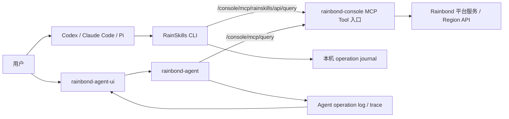
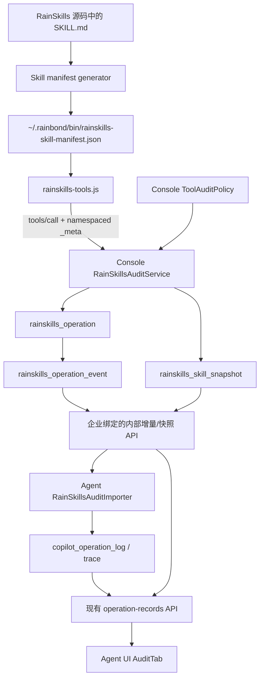
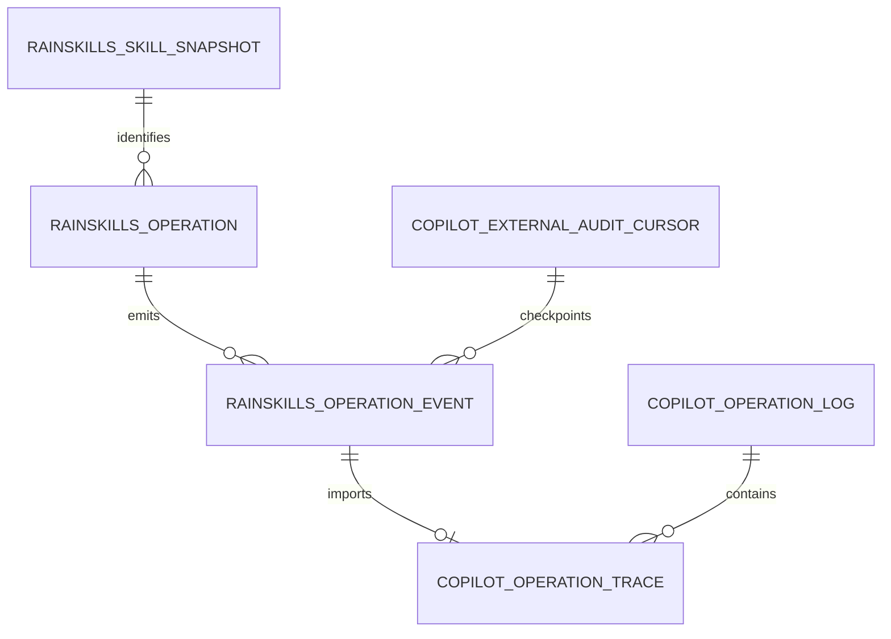

# RainSkills 写操作统一审计与 Skill 内容快照设计文档

> 状态：代码证据审核完成，待设计评审
>
> 审核日期：2026-08-18
>
> 范围：`rainskills`、`rainbond-console`、`rainbond-agent`、`rainbond-agent-ui`
>
> 本文只落实设计和实施计划，不包含业务代码修改。评审通过后再使用 `spec-gen` 生成分仓库 YAML 任务规格。

## 一、项目背景

### 1.1 项目架构

当前 RainSkills CLI 和 rainbond-agent 都会调用 rainbond-console 的 MCP Tool，但只有 Agent 执行链路会投影到 AI 操作记录。



RainSkills CLI 当前绕过 Agent，因此写操作不会进入 `copilot_operation_log` / `copilot_operation_trace`，AI 操作记录页面也无法显示所使用的 CLI Skill 内容。

### 1.2 现有基础与代码证据

#### rainskills

| 现有能力 | 代码证据 | 可复用结论 |
|---|---|---|
| 写操作生成 UUID | `bin/rainskills-tools.js:301` 的 `prepareOperation()` | 直接作为跨服务幂等关联键，不新增第二套客户端 ID |
| 参数摘要与确认绑定 | `bin/rainskills-tools.js:267`、`:318` | 在原校验中追加 Skill ID/digest，不重写确认状态机 |
| 一次性 claim | `bin/rainskills-tools.js:331` | 保持本机重复执行防护 |
| 本地状态 | `bin/rainskills-tools.js:310`、`:659`、`:663` | 保留 awaiting/executing/succeeded/failed/unknown |
| JSON-RPC 调用 | `bin/rainskills-tools.js:440` | 继续调用同一个 endpoint，只扩展 `params._meta` |
| 当前 Tool 参数 | `bin/rainskills-tools.js:639` | 目前只有 `name` 和 `arguments`，是审计 metadata 的准确缺口 |
| CLI/写入分类 | `bin/rainskills-tools.js:24`、`:235` | 仅用于本机 UX，不能作为服务端审计权威 |
| Skill profile manifest | `scripts/build-skill-profile.mjs:302` | 已有 profile/revision/skills 的 manifest 形式，可复用生成模式 |
| POSIX Bridge 安装 | `install.sh:643` | 必须在同一受限目录原子安装 Skill manifest |
| Windows Bridge 安装 | `rainbond-platform-installer/scripts/windows-onboarding.js:330` | Windows 也必须同步安装 manifest，不能只改 `install.sh` |
| 共享传输规则 | `rainbond-app-assistant/references/transport-resolution.md:19` | 只需在中央规则声明 active leaf Skill 参数，不修改全部业务 Skill |

#### rainbond-console

| 现有能力 | 代码证据 | 可复用结论 |
|---|---|---|
| RainSkills 专用路由 | `console/urls/__init__.py:222` | 路由已固定 `deploy_origin=rainskills` 和 `deploy_client=api` |
| JSON-RPC 分发 | `console/views/mcp_query.py:274` | `params` 已完整解析，可读取 namespaced `_meta` |
| 业务 Tool 执行边界 | `console/views/mcp_query.py:370` | `_call_tool()` 是 RainSkills 写审计唯一接入点 |
| 旧服务忽略扩展字段 | `console/views/mcp_query.py:303` | 当前只读取 `params.name/arguments`；新 CLI 向旧 Console 发送 `_meta` 不会改变 Tool 入参 |
| 服务端来源上下文 | `console/services/deployment_invocation.py:26` | 不信任客户端声明来源 |
| 现有部署 tracking | `console/services/rainskills_deployment_service.py:28` | 只覆盖部分部署 Tool，且是统计用途，不能作为完整审计 |
| tracking 临时存储 | `console/repositories/rainskills_deployment_repo.py:12` | 使用 `ConsoleSysConfig`，不满足长期审计、事件游标和 Skill 内容需求 |
| Tool Catalog/dispatch | `console/services/mcp_query_service.py:271`、`:371` | 服务端可对实际暴露 Tool 做完整分类测试 |
| Tool 注解不完整 | `console/services/mcp_query_service.py:6556`、`:8462`、`:8619` | 只有少量删除 Tool 有 destructiveHint，不能直接用 annotations 判定全部写操作 |
| 内部 Agent 鉴权 | `console/services/auth/authentication.py:46` | 可复用集群内来源检查，但新审计接口必须进一步绑定企业 token |
| 传统 operation log | `console/services/operation_log.py:135`、`:171` | 仅 `USE_SAAS` 时 best-effort 写入，字段不足，不作为本方案载体 |

#### rainbond-agent

| 现有能力 | 代码证据 | 可复用结论 |
|---|---|---|
| 操作主表和 trace | `migrations/003_operation_records.sql:1` | RainSkills 事件导入后继续使用统一记录模型 |
| 来源是 SQL ENUM | `migrations/003_operation_records.sql:12` | 增加来源必须同时迁移 SQL、TS 类型和 Zod schema |
| Store 接口 | `src/server/stores/operation-record-store.ts:124` | 导入、游标和企业过滤必须通过 Store 抽象，不能只实现 MySQL |
| MySQL upsert | `src/server/db/stores/mysql-operation-record-store.ts:285` | 可复用幂等写入模式 |
| memory/file/double-write 模式 | `src/server/stores/store-factory.ts:531`、`:604`、`:621`、`:638` | 新 Store 方法必须覆盖所有实现，或明确禁用；主方案选择全部覆盖 |
| 列表 API | `src/server/controllers/copilot-controller.ts:4064` | 可在已有入口做有界同步，不新增浏览器 API |
| 详情 API | `src/server/controllers/copilot-controller.ts:4104` | 可在已有详情响应补充 Skill 快照 |
| Skill 响应依赖 trace | `src/server/controllers/copilot-controller.ts:639` | 只要导入 `skill_selected` trace，现有 `skills` 数组即可扩展 |
| Agent → Console GET 模式 | `src/server/runtime/service-mcp-credential-provider.ts:93` | 复用 base URL、fetch、`X-Internal-Token=enterpriseId` 调用模式 |
| 后台 worker 生命周期 | `src/server/http.ts:2658`、`:2730` | 复用 timer `unref` 和 `stores.cleanup` 关闭模式 |
| 当前 tenant 固定 shared | `src/server/auth/request-context.ts:45`、`src/shared/session-scope.ts:21` | RainSkills 外部数据必须额外按 enterprise 隔离，不能只按 tenant 查询 |
| Skill projector 空实现 | `src/server/operation-records/operation-log-projector.ts:295`、`:374` | 这是既有 Agent 缺口，但与 CLI 审计无依赖，本方案明确不修改 |

#### rainbond-agent-ui

| 现有能力 | 代码证据 | 可复用结论 |
|---|---|---|
| 列表和详情 API | `src/api/index.js:58` | 继续调用 Agent，不新增 UI → Console 数据源 |
| 来源枚举 | `src/pages/content/AuditTab.js:61`、`src/pages/content/helpers.js:55` | 增加 RainSkills CLI 选项和标签 |
| Skills 展示入口 | `src/pages/content/AuditTab.js:268` | 在现有执行信息中扩展版本、digest 和正文折叠面板 |
| 详情兼容 | `src/pages/content/helpers.js:701` | 对缺失新字段保持兜底即可兼容历史数据 |

### 1.3 审核结论与核心需求

本次代码审核对原草案做出以下收敛：

1. 删除独立的 CLI operation 状态查询 API；现有 unknown 恢复继续按业务事实核对，不为审计额外扩展命令面。
2. 删除独立的 Skill 快照上传 API；Skill 内容随已确认的 `tools/call` metadata 一次发送，由 Console 在 Tool 执行前原子登记。
3. 不修改 `OperationLogProjector.createForRun()` 和 `recordSkillSelected()`；RainSkills 使用独立 importer，避免改变旧 Agent 审计链路。
4. Agent 不能无上下文遍历企业；改为列表请求按 `actor.enterpriseId` 有界同步，并只对已经访问过的企业做后台续拉。
5. Skill 正文权威存储在 Console；Agent 详情按需通过内部接口读取，不在 Agent 每条 trace 中复制正文。
6. 错误沿用当前 MCP 约定：HTTP 通常仍为 200，业务错误放在 `result.isError + structuredContent.status_code/error_code`，不虚构新的 HTTP 行为。
7. RainSkills 外部记录单独按 enterprise 过滤；原有 Agent 来源的查询逻辑保持不变。
8. v1 记录“客户端声明的 active leaf Skill 对应的官方安装包 `SKILL.md` 快照”；引用文件只记录 bundle digest，不声称能证明模型运行时实际读取了哪份本地文件或哪些 reference/module。

核心需求：

- 所有从 RainSkills 专用 endpoint 发起的 write/destructive Tool 都由 Console 记录 started 和终态。
- 用户、企业、Tool、风险、scope 和目标上下文由 Console 认证上下文和服务端 policy 生成。
- 新版 CLI 将本地 operation ID、active leaf Skill、版本、摘要和 `SKILL.md` 内容带入审计。
- Agent UI 在统一操作记录中展示 RainSkills 来源、Skill 元数据和可审阅正文。
- 旧 CLI、通用 MCP endpoint、Agent 原有 projector/event 链路在兼容阶段保持行为不变。

非目标：

- 本期不审计只读 Tool。
- 本期不记录模型完整上下文、推理过程或所有被读取的 reference 文件。
- 本期不把 CLI 本地确认伪装成 Agent approval。
- 本期不修复 Agent 自身 `recordSkillSelected()` 空实现。
- 本期不修改 `rainbond` Go 核心服务。

## 二、整体架构设计

### 2.1 系统架构图



权威边界：

- Console 是 RainSkills 操作状态、执行者身份和 Skill 快照的权威来源。
- Agent 是统一查询投影，不决定 RainSkills 操作是否成功。
- UI 只访问 Agent；Agent 在详情阶段代理读取 Console 快照。
- RainSkills manifest 是官方安装包内容与客户端声明之间的自洽证据，不是运行时加载证明或签名证明。

### 2.2 核心流程

#### 新版 CLI 写操作

1. AI 按共享传输规则执行 `call`，同时传 active leaf `--skill-id`；顶层编排可选传 `--root-skill-id`。
2. 首次调用复用现有 `prepareOperation()`，生成 operation ID；journal 同时绑定 Tool、参数摘要、Skill ID 和 Skill digest。
3. 用户确认后，CLI 复用现有 `confirmOperation()` 验证完全相同的 Tool、参数和 Skill。
4. CLI 从受限 manifest 读取 Skill 版本、digest 和 `SKILL.md` 原文，放入 `params._meta["com.rainbond/rainskills"]`。
5. Console 仅在 `is_rainskills_invocation()` 为真时解析该 metadata。
6. Console 用服务端 Tool policy 判定 read/write/destructive、risk 和 scope。
7. 对 write/destructive，Console 在一个数据库事务内：
   - 校验/登记 Skill snapshot；
   - 幂等创建或锁定 operation；
   - 写入 `operation_started` event。
8. started 事务成功后才调用 `mcp_query_service.call_tool()`。
9. Tool 返回或抛错后，Console 更新 operation 并追加 succeeded/failed event。
10. Agent 按企业游标导入事件，生成独立的 `skill_selected` 和 Tool traces。
11. UI 继续用现有列表/详情 API 展示记录；打开详情时 Agent 按 digest 获取 Skill 正文。

#### 旧 CLI 兼容

1. 旧 CLI 不发送 `_meta`。
2. 严格模式关闭时，Console 生成服务端 operation ID，标记 `confirmation_type=legacy_compat`、Skill unknown，仍完整记录 Tool 执行。
3. 严格模式只在覆盖率达标后对 RainSkills endpoint 灰度开启。
4. 通用 `/console/mcp/query` 不启用本 gate。

#### 终态审计写失败

外部 Tool 副作用和数据库终态更新无法形成同一个数据库事务，因此不能声称绝对原子：

- started 写失败：fail closed，不执行 Tool。
- Tool 已执行后终态写失败：不得向客户端谎报“未执行”；保留 started 记录并进行有限重试。
- 内部事件读取时将超过阈值仍为 executing 的记录物化为 unknown 事件，供 Agent/UI 提示人工核对。
- 不因 unknown 自动重放写 Tool，继续遵守现有 `transport-resolution.md`。

## 三、数据模型设计

### 3.1 新增和扩展数据模型

#### rainbond-console：`rainskills_skill_snapshot`

| 字段 | 类型 | 来源/理由 |
|---|---|---|
| `id` | BIGINT PK | Console 内部引用 |
| `enterprise_id` | VARCHAR(64) | 从认证用户获取，隔离可能被客户端修改过的 Skill 内容 |
| `skill_id` | VARCHAR(128) | CLI metadata，必须存在于 manifest |
| `profile` | VARCHAR(16) | v1 固定 `cli` |
| `package_version` | VARCHAR(64) | manifest/package.json |
| `source_revision` | VARCHAR(128) NULL | 有 Git/release revision 时记录，否则允许 NULL |
| `content_sha256` | CHAR(64) | Console 对收到的 UTF-8 原文字节重算 |
| `bundle_sha256` | CHAR(64) NULL | manifest 对 Skill 目录文件清单的稳定摘要 |
| `content_text` | MEDIUMTEXT | active leaf Skill 的 `SKILL.md` 原文 |
| `provenance` | VARCHAR(32) | v1 为 `client_manifest_verified` |
| `created_at` | DATETIME(3) | 首次登记时间 |

唯一键：`(enterprise_id, skill_id, profile, content_sha256)`。

说明：`client_manifest_verified` 只证明 metadata 内正文与 digest 一致，并对应安装时从 RainSkills 包生成的快照；如果用户安装后手工修改客户端 Skill，v1 无法证明模型实际加载了修改后的文件。未来可通过客户端运行时证明或签名发布新增 provenance，不改变 v1 字段。

#### rainbond-console：`rainskills_operation`

| 字段 | 类型 | 来源/理由 |
|---|---|---|
| `id` | BIGINT PK | 内部 ID |
| `operation_id` | VARCHAR(64) | 新 CLI UUID；旧 CLI 由 Console 生成 |
| `enterprise_id` | VARCHAR(64) | 认证用户 |
| `user_id` | VARCHAR(64) | 认证用户 |
| `username` | VARCHAR(128) NULL | 认证用户展示名 |
| `deploy_client` | VARCHAR(32) | 服务端 route context |
| `skill_snapshot_id` | BIGINT NULL | 新版 CLI 关联快照，旧版为空 |
| `skill_id` | VARCHAR(128) NULL | active leaf Skill |
| `root_skill_id` | VARCHAR(128) NULL | 顶层编排 Skill，仅作上下文 |
| `tool_name` | VARCHAR(128) | 实际 dispatch Tool |
| `operation_class` | VARCHAR(16) | 服务端 policy：write/destructive |
| `risk` | VARCHAR(16) | 服务端 policy |
| `scope` | VARCHAR(16) | 服务端 policy |
| `arguments_digest` | CHAR(64) | Console 对实际 arguments 规范化后计算 |
| `input_json` | JSON NULL | 服务端脱敏、限长后的参数 |
| `target_context` | JSON NULL | 服务端白名单提取 |
| `confirmation_type` | VARCHAR(32) | `rainskills_cli` / `legacy_compat` |
| `status` | VARCHAR(32) | executing/succeeded/failed/unknown |
| `output_summary` | TEXT NULL | 脱敏、限长摘要 |
| `error_code` | VARCHAR(64) NULL | 稳定业务错误码 |
| `error_message` | TEXT NULL | 脱敏、限长错误摘要 |
| `started_at` | DATETIME(3) | Tool 前 |
| `finished_at` | DATETIME(3) NULL | Tool 结束或 unknown 物化时间 |
| `created_at` | DATETIME(3) | 创建时间 |
| `updated_at` | DATETIME(3) | 更新时间 |

唯一键：`(enterprise_id, operation_id)`。

幂等规则：同 operation ID 的 Tool、arguments digest、Skill ID 或 Skill digest 任一不一致，返回 `operation_conflict`；相同 operation 已存在时不得再次调用 Tool。

#### rainbond-console：`rainskills_operation_event`

| 字段 | 类型 | 说明 |
|---|---|---|
| `id` | BIGINT PK AUTO_INCREMENT | Agent cursor |
| `event_id` | VARCHAR(128) UNIQUE | 全局幂等事件 ID |
| `enterprise_id` | VARCHAR(64) | 企业隔离 |
| `operation_id` | VARCHAR(64) | 关联 operation |
| `event_type` | VARCHAR(64) | operation_started/succeeded/failed/unknown |
| `payload` | JSON | 脱敏后的 `rainskills.operation.v1` |
| `created_at` | DATETIME(3) | 事件时间 |

事件 payload 不携带 `content_text`，只携带 Skill digest/版本；正文通过企业绑定的内部快照接口按需读取。

#### rainbond-agent：现有 operation 表扩展

`copilot_operation_log`：

- SQL ENUM 和 TypeScript `OperationSource` 增加 `rainskills_cli`。
- 不改变现有来源的创建、更新和过滤逻辑。
- RainSkills 合成 ID 包含 enterprise hash，避免同一客户端 UUID 在不同企业冲突。

`copilot_operation_trace` 新增 nullable 字段：

- `root_skill_id`
- `skill_version`
- `skill_revision`
- `skill_digest`
- `skill_bundle_digest`
- `skill_profile`
- `skill_provenance`
- `confirmation_type`
- `external_event_id`

其中 Agent `skill_version` 存储 Console event 的 `skill.package_version`；详情 serializer 对外仍使用语义更明确的 `package_version`。`skill_revision`、`skill_digest`、`skill_bundle_digest` 分别映射为 `source_revision`、`content_sha256`、`bundle_sha256`。

新增 `copilot_external_audit_cursor`：

| 字段 | 类型 | 说明 |
|---|---|---|
| `tenant_id` | VARCHAR(64) | 当前仍为 shared，与现有 Store 一致 |
| `enterprise_id` | VARCHAR(64) | Console 企业 |
| `source` | VARCHAR(32) | v1 固定 rainskills_cli |
| `last_cursor` | BIGINT | 最后一条完整导入事件 |
| `updated_at` | DATETIME(3) | 更新时间 |

主键：`(tenant_id, enterprise_id, source)`。

Agent 不复制 Skill 正文表；详情 API 使用 trace 中的 digest 向 Console 受控读取，避免 memory/file/mysql 三种 Store 重复实现大文本快照。

### 3.2 数据关系和隔离



隔离规则：

- Console 模型、事件和快照全部带 `enterprise_id`。
- Console 内部接口不接受客户端传 enterprise ID；由企业绑定 token 推导。
- Agent 的 tenant 固定为 shared，因此新增查询参数 `externalEnterpriseId` 只过滤 `source=rainskills_cli` 的行。
- 原有 chat/scheduled_task/feishu 行不套用新过滤条件，避免本次功能改变旧链路结果集。
- Agent 详情对 `rainskills_cli` 记录额外校验 `log.enterpriseId === actor.enterpriseId`。

## 四、API设计

### 4.1 现有 MCP `tools/call` 扩展

路径和 JSON-RPC method 不变：

```text
POST /console/mcp/rainskills/api/query
method = tools/call
```

请求示例：

```json
{
  "jsonrpc": "2.0",
  "id": 1,
  "method": "tools/call",
  "params": {
    "name": "rainbond_create_app",
    "arguments": {
      "team_name": "team-a",
      "region_name": "rainbond",
      "app_name": "demo"
    },
    "_meta": {
      "com.rainbond/rainskills": {
        "schema": "rainskills.operation-meta.v1",
        "operation_id": "7fb73c8a-89af-4b69-8f4f-6a73d8fa3d5a",
        "cli_version": "2.1.0",
        "confirmation_type": "rainskills_cli",
        "root_skill_id": "rainbond-app-assistant",
        "skill": {
          "id": "rainbond-fullstack-bootstrap",
          "profile": "cli",
          "package_version": "1.0.0",
          "source_revision": null,
          "content_sha256": "<sha256>",
          "bundle_sha256": "<sha256>",
          "content": "# SKILL.md 原文..."
        }
      }
    }
  }
}
```

可信边界：

- 客户端可声明 operation/Skill 关联，但不能声明 user、enterprise、deploy client、risk、scope 或目标资源。
- Console 重算 arguments digest 和 Skill content digest。
- `_meta` 绝不传入 `mcp_query_service.call_tool()` 的业务 arguments。
- metadata 总大小不超过 160 KiB，Skill UTF-8 正文不超过 128 KiB。

### 4.2 Console → Agent 内部接口

#### 增量事件

```text
GET /console/internal/agent-rainskills-audit/events?after_cursor=0&limit=100
X-Internal-Token: <enterprise_id>
```

- `limit` 默认 100，最大 500。
- enterprise 从 token 推导，不提供 `enterprise_id` query 参数。
- 返回 `id ASC` 的稳定 cursor。

```json
{
  "data": [
    {
      "cursor": 101,
      "event": {
        "schema": "rainskills.operation.v1",
        "event_id": "rs_evt_...",
        "event_type": "operation_started",
        "occurred_at": "2026-08-18T10:00:00.000Z",
        "operation": {},
        "skill": {}
      }
    }
  ],
  "meta": {
    "next_cursor": 101,
    "has_more": false
  }
}
```

#### Skill 快照读取

```text
GET /console/internal/agent-rainskills-audit/skill-snapshots/{content_sha256}?skill_id={skill_id}&profile=cli
X-Internal-Token: <enterprise_id>
```

- 只返回 token 所属企业的匹配快照。
- 找不到或企业不匹配统一返回 404。
- 正文只通过 Agent 管理员详情接口间接返回，不新增浏览器直连 Console。

### 4.3 现有 Agent operation-records 响应扩展

列表路径不变：

```text
GET /api/v1/copilot/operation-records?source=rainskills_cli
```

- `data[].source` 新增值 `rainskills_cli`。
- `meta.stats.sources.rainskills_cli` 为数字；旧来源字段保持不变。
- 列表不返回 Skill 正文。

详情路径不变：

```text
GET /api/v1/copilot/operation-records/{operation_id}
```

RainSkills 详情在现有 `data.skills` 中追加可选字段，并增加独立 confirmation：

```json
{
  "data": {
    "operation": {
      "operation_id": "rs_...",
      "source": "rainskills_cli"
    },
    "skills": [
      {
        "skill_id": "rainbond-fullstack-bootstrap",
        "root_skill_id": "rainbond-app-assistant",
        "name": "rainbond-fullstack-bootstrap",
        "profile": "cli",
        "package_version": "1.0.0",
        "source_revision": null,
        "content_sha256": "<sha256>",
        "bundle_sha256": "<sha256>",
        "provenance": "client_manifest_verified",
        "content": "# SKILL.md 原文...",
        "content_available": true
      }
    ],
    "confirmation": {
      "type": "rainskills_cli"
    }
  }
}
```

- 历史 Agent 记录继续只返回现有 `skill_id/name`，新增字段允许缺失。
- Console 快照不可用时返回 `content=null`、`content_available=false`，其他详情仍可查看。
- CLI confirmation 不进入 `approvals`，也不增加 approval_count。

### 4.4 错误契约

`tools/call` 保持现有 MCP 返回形态：认证完成后的业务失败通常仍是 HTTP 200，错误位于 `result`：

```json
{
  "jsonrpc": "2.0",
  "id": 1,
  "result": {
    "isError": true,
    "structuredContent": {
      "status_code": 409,
      "error_code": "operation_conflict",
      "msg": "operation metadata conflicts with the existing operation",
      "msg_show": "操作标识与已有记录不一致"
    }
  }
}
```

稳定业务错误：

| status_code | error_code | 使用场景 |
|---|---|---|
| 400 | `invalid_operation_metadata` | schema、UUID、Skill ID 或大小非法 |
| 409 | `operation_conflict` | operation ID 绑定信息不一致 |
| 409 | `operation_already_recorded` | 相同 operation 已进入执行/终态，Tool 不重放 |
| 422 | `skill_digest_mismatch` | Console 重算 digest 不一致 |
| 428 | `operation_confirmation_required` | 严格模式下缺 metadata/confirmation |
| 503 | `audit_unavailable` | started 审计不能可靠落库，Tool 未执行 |

`bin/rainskills-tools.js:518` 和 `:649` 已能识别 MCP Tool 的 `isError/structuredContent`，只需保留 `error_code` 到安全诊断信息，不需要改变 HTTP transport。

### 4.5 跨仓库 API 兼容矩阵

| 调用方 | 服务方 | 契约 | 需要同步验证的字段 |
|---|---|---|---|
| `rainskills/bin/rainskills-tools.js` | `rainbond-console/console/views/mcp_query.py` | 现有 `tools/call` + `_meta` | schema、operation_id、cli_version、confirmation_type、root_skill_id、skill 全字段 |
| `rainbond-agent/rainskills-audit-client.ts` | `rainbond-console/internal_rainskills_audit.py` | 新增 events GET | cursor、event schema、operation/skill 字段、has_more |
| `rainbond-agent/rainskills-audit-client.ts` | `rainbond-console/internal_rainskills_audit.py` | 新增 snapshot GET | skill_id、profile、content_sha256、content、provenance |
| `rainbond-agent-ui/src/api/index.js` | `rainbond-agent` controller | 现有 operation list | source、stats.sources、分页字段不变 |
| `rainbond-agent-ui/AuditTab.js` | `rainbond-agent` controller | 现有 operation detail | skills 可选扩展、confirmation、content_available |

兼容检查不涉及 `rainbond` Go API：Console 调用的 `mcp_query_service.call_tool(user, name, arguments)` 形态和 Region API 请求均不改变。

## 五、核心实现设计

### 5.1 关键逻辑

#### 服务端 ToolAuditPolicy

Console 当前只有三个 destructive annotations，不能由 Tool schema 自动得到完整写分类，因此新增显式 policy：

- `READ_ONLY_TOOL_NAMES`：明确只读 Tool。
- `MUTABLE_TOOL_POLICY`：Tool → operation_class/risk/scope。
- 当前 Agent `MUTABLE_TOOL_POLICY_LIST` 可作为初始核对依据，但 Console policy 是 RainSkills 审计唯一权威，不在运行时依赖 Agent 仓库。
- 未知但可见的 `rainbond_*` Tool 默认 write + medium，防止新 Tool 漏审计。
- 单元测试用 `mcp_query_service.list_tools(admin)` 校验每个 RainSkills 可见 Tool 都有唯一分类；隐藏 Tool 不进入 CLI policy 覆盖集。

#### 审计事务和幂等

在 `_dispatch_rpc()` 中保留 `_meta`，以独立参数传给 `_call_tool()`；业务 `arguments` 不变。

write/destructive 流程：

1. `assert_tool_visible()` 保留现有可见性检查。
2. 服务端 policy 分类。
3. metadata 校验；兼容模式缺失时生成服务端 ID。
4. 参数和正文脱敏/大小校验。
5. `transaction.atomic()` + 唯一键/行锁登记 snapshot、operation、started event。
6. 如果发现相同 operation，返回已有状态，不调用 Tool。
7. 首次执行所有者才调用 `mcp_query_service.call_tool()`。
8. 成功/失败用新事务更新 operation 并 append 终态事件。

#### Skill manifest 和归属

- 新 generator 只扫描安装包源码中的 `rainbond-*/SKILL.md`，读取 frontmatter name，计算原文字节 SHA-256；不扫描 Codex/Claude/Pi 的可变安装目录。
- bundle digest 对按相对路径排序后的文件路径、大小和内容 digest 计算，不把本机绝对路径写入 manifest。
- manifest 安装到 `~/.rainbond/bin/rainskills-skill-manifest.json`，权限 0600，目录保持 0700。
- POSIX 和 Windows installer 都使用临时文件 + rename，并验证 CLI 支持的 manifest schema/version。
- `call` 的首次和 confirmed 形式都必须带 `--skill-id`；journal 从第一次调用起绑定 Skill。
- `--root-skill-id` 可选，只表达编排来源，不能代替 active leaf。
- 中央 `transport-resolution.md` 已被各业务 Skill 引用；只修改中央契约和测试，不批量修改所有业务 Skill 文件。

#### 脱敏和限制

- Console 新增与 Agent `sanitize-operation-trace.ts` 对齐的测试向量，不跨语言导入实现。
- 敏感键至少覆盖 password/passwd/token/secret/api_key/authorization/cookie/kubeconfig/certificate/private_key。
- Kubernetes Secret 的 `data/stringData` 整体替换。
- `input_json` 最大 32 KiB；超过后只保留目标白名单、键名和 digest。
- `output_summary`、`error_message` 各最大 2 KiB。
- Skill 正文最大 128 KiB；超限时新版 CLI 写操作停止，不产生“已记录正文”的错误承诺。
- 本地 journal 不保存 Skill 正文、完整 arguments 或完整响应，只保存 Skill ID/digest。

#### Agent 导入和详情

- `RainSkillsAuditImporter.syncEnterprise(tenantId, enterpriseId, budget)` 只接收已认证 actor 的 enterprise ID。
- 操作列表请求先做有界同步，例如最多一页或 300 ms；超时只返回本地已有数据，不让 Console 故障拖垮旧审计 API。
- 已见 enterprise 可由进程内集合触发后台续拉；进程重启后由下一次列表请求恢复。
- 一批事件导入和 cursor 推进通过 Store 的单一方法完成；MySQL 使用事务，memory/file 使用确定性 ID + 写后推进，重放仍幂等。
- importer 对 Console payload 再执行 Agent 脱敏，生成：
  - 一条确定性的 `skill_selected` trace；
  - started/terminal Tool trace；
  - approval_count=0，confirmation 单独记录。
- operation 列表只对 `rainskills_cli` 套 enterprise 条件；旧来源条件不变。
- 详情读取 snapshot 失败时仍返回操作和 trace，`skill.content_available=false`，不让外部依赖破坏历史审计查看。
- 合成主键使用固定算法并受现有 VARCHAR(64) 限制：operation/run ID 由 enterprise SHA-256 短值和去连字符 UUID 组成，trace ID 由 external event ID 的 SHA-256 短值组成；不能直接截断原始字符串造成碰撞。

### 5.2 兼容性与旧链路影响

| 场景 | 行为 | 代码依据 |
|---|---|---|
| 新 CLI → 旧 Console | `_meta` 被忽略，现有 `name/arguments` 正常执行 | `mcp_query.py:303` 只读取这两个字段 |
| 旧 CLI → 新 Console | strict 关闭时生成 legacy operation，Skill 为空 | 新 gate 的兼容分支 |
| Agent 原有 approval 审计 | projector/publisher 不修改 | 本计划删除原 Task 4.4 |
| Agent 历史 schema | 新 trace 字段 nullable；source ENUM 只追加值 | migration 设计 |
| Agent 旧来源查询 | enterprise 条件仅作用于 rainskills_cli | Store filter 设计 |
| Console 传统 operation_log | 不改表、不改调用点 | 独立 RainSkills 模型 |
| 通用 MCP endpoint | 不启用 RainSkills gate | `is_rainskills_invocation()` |
| UI 历史详情 | 新字段为空时维持现有兜底 | `helpers.js:701` |

严格模式默认关闭，发布顺序最后才开启。开启前必须观察：metadata 覆盖率、snapshot 校验率、Agent import lag 和 legacy 调用量。

## 六、实施计划

### Sprint 1: Console 权威审计基础

#### Task 1.1: 建立 Tool policy 和 metadata 契约

- 依赖：`mcp_query_service.list_tools()`、RainSkills 专用 invocation context。
- 修改/新增：
  - `rainbond-console/console/services/rainskills_audit_contract.py`（新增）
  - `rainbond-console/console/services/rainskills_tool_audit_policy.py`（新增）
  - `rainbond-console/console/tests/rainskills_audit_contract_test.py`（新增）
  - `rainbond-console/console/tests/rainskills_tool_audit_policy_test.py`（新增）
- 实现：metadata schema、显式 read/mutable policy、未知 Tool 默认策略、目标白名单、脱敏限制。
- 验收：
  - 当前 RainSkills Catalog 的每个 Tool 恰好归入 read 或 mutable。
  - metadata 不能覆盖 actor/risk/scope/target。
  - 非法 UUID、Skill ID、digest、超长正文被拒绝。

#### Task 1.2: 新增 Console 三张审计表

- 依赖：Django model/repository 现有分层。
- 修改/新增：
  - `rainbond-console/console/models/main.py:1292`（相邻新增模型）
  - `rainbond-console/console/migrations/<makemigrations生成编号>_rainskills_operation_audit.py`（新增，不预写死 0009）
  - `rainbond-console/console/repositories/rainskills_audit_repo.py`（新增 singleton）
  - `rainbond-console/console/tests/rainskills_audit_repo_test.py`（新增）
- 实现：snapshot/operation/event、唯一键、行锁、游标分页、终态更新。
- 验收：
  - 同企业同 operation ID 并发只有一个执行所有者。
  - 不同企业可使用相同客户端 UUID 且互不可见。
  - snapshot 按企业/Skill/profile/digest 去重。
  - migration 正向执行，旧 `operation_log` 不变。

#### Task 1.3: 在 MCP 执行边界接入审计 gate

- 依赖：Task 1.1、1.2；`MCPQueryRPCMixin._dispatch_rpc/_call_tool`。
- 修改/新增：
  - `rainbond-console/console/views/mcp_query.py:274`
  - `rainbond-console/console/views/mcp_query.py:370`
  - `rainbond-console/console/services/rainskills_audit_service.py`（新增 singleton）
  - `rainbond-console/console/tests/mcp_query_rainskills_audit_test.py`（新增）
  - `rainbond-console/console/tests/mcp_deployment_invocation_test.py`（回归现有 deployment tracking）
- 实现：独立传递 `_meta`、started fail-closed、Tool 执行、终态更新、legacy 分支、unknown 物化。
- 验收：
  - 审计 started 落库失败时 Tool mock 从未被调用。
  - Tool 抛错仍生成 failed event。
  - metadata 不进入业务 arguments。
  - 相同 operation 重放不二次调用 Tool。
  - HTTP/MCP 错误形态与现有 `isError/structuredContent` 一致。
  - 现有 RainSkills deployment tracker 的 classify/begin/bind/failure 调用语义不变。

### Sprint 2: RainSkills Skill manifest 与 metadata

#### Task 2.1: 生成 CLI Skill manifest

- 依赖：现有 Skill 目录、package.json、`build-skill-profile.mjs` 的 manifest 生成模式。
- 修改/新增：
  - `rainskills/scripts/build-skill-manifest.mjs`（新增）
  - `rainskills/package.json`
  - `rainskills/tests/skill-manifest-builder.test.js`（新增）
  - `rainskills/tests/npm-package.test.js`
- 实现：读取 frontmatter、保存 `SKILL.md` 原文、content/bundle digest、package version、可选 revision。
- 验收：
  - 同一源码稳定生成同一 digest。
  - 任意正文变化导致 content digest 变化。
  - 相对文件内容变化导致 bundle digest 变化。
  - manifest 无绝对路径、凭据或环境变量值。
  - npm 包包含 generator。

#### Task 2.2: POSIX/Windows 原子安装 manifest

- 依赖：Task 2.1；现有 Bridge 原子安装函数。
- 修改：
  - `rainskills/install.sh:643`
  - `rainskills/rainbond-platform-installer/scripts/windows-onboarding.js:330`
  - `rainskills/tests/install.sh.test`
  - `rainskills/tests/windows-onboarding.test.js`
- 实现：安装时生成 manifest，与 CLI 安装到同一受限目录；临时文件、权限、备份和失败恢复沿用 Bridge 模式。
- 验收：
  - 两个平台最终 manifest 权限和路径正确。
  - 中途失败不留下 CLI/manifest schema 不匹配的可执行组合。
  - symlink/reparse point 防护仍有效。

#### Task 2.3: 扩展 CLI command/journal/MCP metadata

- 依赖：Task 2.1、2.2；Console Task 1.3 保持兼容。
- 修改：
  - `rainskills/bin/rainskills-tools.js:151`
  - `rainskills/bin/rainskills-tools.js:301`
  - `rainskills/bin/rainskills-tools.js:318`
  - `rainskills/bin/rainskills-tools.js:639`
  - `rainskills/tests/api-bridge.test.js`
- 实现：`--skill-id`、可选 `--root-skill-id`、manifest 解析、journal 绑定 Skill、confirmed call 发送 `_meta`。
- 验收：
  - write/destructive 首次调用缺 Skill ID 时不联网。
  - read 命令不要求 Skill metadata，行为不变。
  - Tool/arguments/Skill/digest 任一变化都使确认失效。
  - manifest 缺失、权限不安全、schema 不兼容、digest 不匹配时写操作不联网。
  - stdout/stderr/journal 不输出 Skill 正文或 Secret。

#### Task 2.4: 更新中央 Skill 调用契约

- 依赖：Task 2.3；所有业务 Skill 已引用中央 transport 文档。
- 修改：
  - `rainskills/rainbond-app-assistant/references/transport-resolution.md:19`
  - `rainskills/tests/transport-resolution.test.js`
  - `rainskills/tests/skill-console-contract.test.js`
- 实现：定义 active leaf Skill 取值、首次/确认两次调用都传同一 Skill、root 只作可选编排信息。
- 验收：
  - 不批量修改无直接命令模板的业务 `SKILL.md`。
  - 契约测试证明所有 CLI profile Skill 都引用同一 transport 规则。
  - 只读 `rainbond-platform-query` 不被迫使用 `call`。

### Sprint 3: Console 内部导出与 Agent 投影

#### Task 3.1: 增加企业绑定的内部鉴权和审计读取 API

- 依赖：Console Task 1.2；现有 `AgentRuntimeAuthentication` 的集群内检查。
- 修改/新增：
  - `rainbond-console/console/services/auth/authentication.py:46`
  - `rainbond-console/console/views/internal_rainskills_audit.py`（新增）
  - `rainbond-console/console/urls/__init__.py:234`
  - `rainbond-console/console/tests/internal_rainskills_audit_view_test.py`（新增）
- 实现：新增 enterprise-bound auth（拒绝 legacy global token）、事件 cursor API、snapshot 读取 API。
- 验收：
  - 代理头/公网来源被现有集群内 gate 拒绝。
  - token 必须精确匹配 `TenantEnterprise.enterprise_id`。
  - API 不接受 enterprise query 参数。
  - 跨企业快照统一 404。
  - cursor 顺序稳定、limit 有上限。

#### Task 3.2: 扩展 Agent schema 和所有 Store 实现

- 依赖：现有 operation Store 抽象和 `003_operation_records.sql`。
- 修改：
  - `rainbond-agent/migrations/025_rainskills_operation_audit.sql`（新增）
  - `rainbond-agent/src/server/db/schema.ts:157`
  - `rainbond-agent/src/server/stores/operation-record-store.ts:3`
  - `rainbond-agent/src/server/db/stores/mysql-operation-record-store.ts`
  - `rainbond-agent/src/server/stores/file-stores.ts:836`
  - `rainbond-agent/src/server/stores/store-factory.ts:531`
  - `rainbond-agent/tests/server/db/migrator.test.ts`
  - `rainbond-agent/src/server/stores/operation-record-store.test.ts`
- 实现：source ENUM、trace nullable 字段、external cursor、批量幂等导入、RainSkills 专用企业过滤。
- 验收：
  - memory/file/mysql/double-write 全部满足新接口。
  - 历史行通过 Zod 解析。
  - external event 重放不重复 trace。
  - cursor 只在整批成功后推进。
  - 新企业过滤不改变 chat/scheduled_task/feishu 结果。

#### Task 3.3: 实现 Agent Console client 与 importer

- 依赖：Task 3.1、3.2；现有 service credential provider 的 fetch 模式。
- 新增/修改：
  - `rainbond-agent/src/server/operation-records/rainskills-audit-client.ts`（新增）
  - `rainbond-agent/src/server/operation-records/rainskills-audit-client.test.ts`（新增）
  - `rainbond-agent/src/server/operation-records/rainskills-audit-importer.ts`（新增）
  - `rainbond-agent/src/server/operation-records/rainskills-audit-importer.test.ts`（新增）
  - `rainbond-agent/src/server/http.ts`
- 实现：enterprise token、超时、schema 校验、状态映射、确定性 operation/trace ID、有界同步和后台续拉。
- 验收：
  - 没有 actor enterprise ID 时不拉取、不伪造默认企业。
  - Console 超时不导致原 operation-records API 失败。
  - Agent 停机后按 cursor 补齐。
  - payload 再脱敏后才写 Agent Store。
  - 不调用 `OperationLogProjector`，不伪造 approval 事件。
  - 后台 timer 使用 `unref` 并注册到现有 `stores.cleanup`，服务关闭时无资源泄漏。

#### Task 3.4: 扩展现有 operation-records 响应

- 依赖：Task 3.2、3.3；现有 serializer 和详情 API。
- 修改：
  - `rainbond-agent/src/server/controllers/copilot-controller.ts:639`
  - `rainbond-agent/src/server/controllers/copilot-controller.ts:4064`
  - `rainbond-agent/src/server/controllers/copilot-controller.ts:4104`
  - 相关 controller/http tests
- 实现：列表前有界同步、RainSkills enterprise 校验、Skill 元数据序列化、详情按需获取正文、confirmation 单独返回。
- 验收：
  - 现有响应字段不删除、不改类型。
  - 旧记录 `skills` 结构仍兼容。
  - RainSkills 正文获取失败时详情仍返回 200，并标记不可用。
  - 其他企业的 RainSkills operation ID 返回 404。

### Sprint 4: UI 展示

#### Task 4.1: 展示 RainSkills 来源、confirmation 和 Skill 正文

- 依赖：Agent Task 3.4；继续使用现有 API 函数。
- 修改/新增：
  - `rainbond-agent-ui/src/pages/content/AuditTab.js:61`
  - `rainbond-agent-ui/src/pages/content/AuditTab.js:268`
  - `rainbond-agent-ui/src/pages/content/helpers.js:55`
  - `rainbond-agent-ui/src/pages/content/helpers.js:701`
  - `rainbond-agent-ui/tests/audit-rainskills.test.js`（新增）
  - `rainbond-agent-ui/package.json`（把新测试加入 `test:configuration`）
- 实现：来源选项、Skill 版本/digest/provenance、正文折叠查看、CLI confirmation 与 Agent approval 分栏。
- 验收：
  - 旧 operation 响应渲染不报错。
  - 新记录显示 leaf/root、Tool、版本、digest、confirmation 和正文。
  - 正文不可用时显示明确状态，不显示空白成功态。
  - 不新增 UI → Console 请求。
  - Skill 正文按纯文本 `<pre>` 展示，不用允许原始 HTML 的 Markdown 渲染路径。

### Sprint 5: 兼容灰度、验证与发布

#### Task 5.1: 覆盖率观测和严格模式

- 依赖：Sprint 1-4 全部完成。
- 修改：
  - `rainbond-console/console/services/rainskills_audit_service.py`
  - `rainbond-console/console/views/mcp_query.py`
  - 对应 Console tests
- 指标：metadata_present、snapshot_verified、legacy_compat、terminal_unknown、Agent cursor lag。
- 严格模式：仅 RainSkills endpoint、默认关闭、按环境配置；通用 MCP 不受影响。
- 验收：旧 CLI 在 strict=false 时继续执行并被审计；strict=true 时缺 metadata 的写调用返回 structuredContent 428。

#### Task 5.2: 完整验证

- rainskills：`npm test`。
- rainbond-console：`make format`、`make check`、相关 pytest、migration check。
- rainbond-agent：`npm test`、`npm run build:server`、migration validate。
- rainbond-agent-ui：`npm run test:configuration`、`npm run build`。
- 跨仓库：运行 `check-api-compat`，逐项核对 metadata、event schema、source、Skill 字段、错误码和企业隔离。
- 所有验证通过后才允许各仓库分别提交。

#### Task 5.3: 发布顺序与回滚

1. 发布 Console 表、兼容采集和内部 API，strict=false。
2. 发布 Agent schema/importer/API 扩展。
3. 发布 Agent UI。
4. 发布 RainSkills CLI/manifest。
5. 观察至少一个完整发布周期。
6. 最后灰度开启 strict。

回滚：

- UI/Agent 回滚不删除 Console 权威审计数据。
- importer 回滚只停止导入，原 Agent projector 继续工作。
- Console 回滚前保留新增表，不做破坏性 downgrade。
- strict 可立即关闭恢复旧 CLI。
- RainSkills CLI 回滚后，Console 继续以 `legacy_compat` 记录。

## 七、关键参考代码

| 设计点 | 代码位置 | 审核结论 |
|---|---|---|
| CLI operation journal | `rainskills/bin/rainskills-tools.js:267-350` | 复用 ID、digest、确认和状态机 |
| CLI MCP 请求 | `rainskills/bin/rainskills-tools.js:440-550` | 复用同一 JSON-RPC transport |
| confirmed Tool call | `rainskills/bin/rainskills-tools.js:605-666` | 唯一 metadata 注入点 |
| 中央 Skill 传输规则 | `rainskills/rainbond-app-assistant/references/transport-resolution.md:19-35` | 只改一份归属规则 |
| embedded manifest | `rainskills/scripts/build-skill-profile.mjs:268-313` | 复用生成模式，不把 embedded 内容当 CLI 内容 |
| POSIX Bridge 安装 | `rainskills/install.sh:643-684` | manifest 必须同级安全安装 |
| Windows Bridge 安装 | `rainskills/rainbond-platform-installer/scripts/windows-onboarding.js:330-394` | Windows 是必要修改项 |
| RainSkills MCP 路由 | `rainbond-console/console/urls/__init__.py:216-224` | 服务端固定来源和 client |
| MCP 分发 | `rainbond-console/console/views/mcp_query.py:274-360` | 保持 MCP 错误形态 |
| RainSkills Tool wrapper | `rainbond-console/console/views/mcp_query.py:370-437` | 审计 gate 接入点 |
| Tool catalog | `rainbond-console/console/services/mcp_query_service.py:271-333` | policy 完整性测试输入 |
| 内部 auth | `rainbond-console/console/services/auth/authentication.py:46-102` | 复用网络 gate，新增企业强绑定 |
| 旧 operation log | `rainbond-console/console/services/operation_log.py:135-174` | 明确不复用 |
| Agent operation DDL | `rainbond-agent/migrations/003_operation_records.sql:1-58` | additive migration 基础 |
| Agent schema | `rainbond-agent/src/server/db/schema.ts:157-225` | source/trace/cursor 类型扩展 |
| Agent Store | `rainbond-agent/src/server/stores/operation-record-store.ts:124-149` | 所有持久化实现共同契约 |
| Agent MySQL Store | `rainbond-agent/src/server/db/stores/mysql-operation-record-store.ts:285-570` | 查询、stats、detail、upsert 复用 |
| Agent shared tenant | `rainbond-agent/src/server/auth/request-context.ts:45-77` | 新外部数据必须额外企业隔离 |
| Agent serializers | `rainbond-agent/src/server/controllers/copilot-controller.ts:600-675` | 扩展现有 skills/detail 响应 |
| Agent operation API | `rainbond-agent/src/server/controllers/copilot-controller.ts:4064-4135` | 有界同步与详情快照入口 |
| Agent Skill 空实现 | `rainbond-agent/src/server/operation-records/operation-log-projector.ts:295-377` | 与本需求解耦，不修改 |
| UI operation API | `rainbond-agent-ui/src/api/index.js:58-70` | 不新增 API 函数 |
| UI AuditTab | `rainbond-agent-ui/src/pages/content/AuditTab.js:61-68`、`:268-326` | 扩展现有来源和 Skills 区域 |
| UI normalize | `rainbond-agent-ui/src/pages/content/helpers.js:701-763` | 历史字段兼容 |

### 项目范围结论

必须修改四个项目：

1. `rainbond-console`：权威审计、Tool policy、Skill 快照、企业绑定的内部导出。
2. `rainskills`：Skill manifest、CLI metadata、journal 绑定、POSIX/Windows 安装与中央传输规则。
3. `rainbond-agent`：外部事件导入、Store/schema 扩展、企业隔离、现有 API 响应扩展。
4. `rainbond-agent-ui`：RainSkills 来源、confirmation、Skill 元数据和正文展示。

不需要修改：

- `rainbond`：Console 仍调用现有业务/Region API，协议不变。
- 全部业务 Skill 文件：它们已经引用中央 transport 规则，没有直接 CLI command 模板；除非实施时发现某个 Skill 绕过中央规则，否则不批量修改。
- Agent `OperationLogProjector`：RainSkills importer 独立写投影，旧 Agent 审计链路保持不变。
