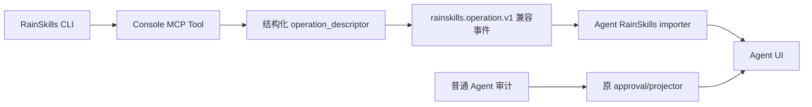

# RainSkills 审计语义统一设计文档

> 状态：设计已确认，实施完成，验证中
>
> 范围：`rainskills`、`rainbond-console`、`rainbond-agent`、`rainbond-agent-ui`
>
> 兼容承诺：不修改普通 Agent 的审批/projector 路径，不重算历史记录，不改变现有统计字段。

## 一、项目背景

### 1.1 项目架构

RainSkills 写操作由 Console 执行并产生外部审计事件，Agent 将事件投影为统一操作记录，UI 展示 Agent 返回的记录。业务语义因此必须由了解实际 MCP 实现和数据库资源的 Console 提供，但记录、审批和展示职责仍保留在 Agent/UI。



### 1.2 现有基础

| 能力/缺口 | 现实代码依据 | 设计结论 |
|---|---|---|
| Console 只按工具名分类 | `rainbond-console/console/services/rainskills_tool_audit_policy.py:133` 的 `classify_tool(tool_name)` | 改为 `classify_tool(tool_name, arguments)`，只有 RainSkills gate 使用 |
| CLI 也只按工具名前缀分类 | `rainskills/bin/rainskills-tools.js:298-304,699-709` | CLI 必须同步参数级分类，否则真实写操作没有确认 metadata，查询子操作仍被误拦截 |
| `operate_app` 支持单个、多个、全部组件 | `mcp_query_service.py:1746-1777`，缺省 `service_ids` 时使用应用全部组件 | scope 和 target mode 必须根据参数动态计算 |
| Console 已有组件批量查询 | `mcp_query_service.py:1793-1797` 调用 `service_repo.get_services_by_service_ids` | 复用批量查询，禁止逐组件查询和客户端名称作为权威来源 |
| 目标提取只支持标量 | `rainskills_audit_service.py:28-41,75-103` | 扩展 `service_ids`，同时保存长 ID、`gr...` alias、名称 |
| 环境变量工具同时包含读写操作 | `mcp_query_service.py:1876-1969`，`summary` 只读，其余修改 | 不能把整个 manage 工具静态归为写操作 |
| 端口工具同样混合读写 | `mcp_query_service.py:2116-2137` 的 `summary` 分支 | 使用操作别名集合分类 |
| Agent 普通审批已有动态 scope | `mutable-tool-policy.ts:234-264,399-410` | 语义规则与其对齐，但本期不改该文件，防止非 Skills 文案变化 |
| RainSkills importer 独立于普通 projector | `rainskills-audit-importer.ts:35-62` | 新描述只在 importer 消费，普通 Agent 输出逐字段保持不变 |
| Agent 已有扩展 JSON | `OperationLogRecord.targetContext` 及各 Store 现有 JSON 字段 | descriptor 存入 RainSkills 的 `targetContext.operation_descriptor`，不新增 Agent 表列 |
| UI 当前从中文内容推断目标 | `helpers.js:405-467,538-606` | 新记录优先读取 descriptor，旧记录继续走现有回退 |

### 1.3 核心需求

1. 参数级区分读、写和用户只读但伴随系统同步的接口。
2. 正确表达动作、子资源、单/多/全部目标。
3. 明确区分内部长 ID、页面跳转 alias 和显示名称。
4. 新协议为可选字段，旧 Console/Agent/UI 可互相兼容。
5. 非 RainSkills 新记录的 `operation_type`、`operation_content`、审批、风险、统计输出保持不变。

## 二、整体架构设计

### 2.1 系统架构图

Console 生成稳定语义码，不生成与 UI 耦合的 JSX 或链接：

```json
{
  "schema": "rainskills.audit-operation.v1",
  "effect": "write",
  "action": "restart",
  "resource_type": "component_runtime",
  "scope": "component",
  "target_mode": "single",
  "targets": [
    {
      "type": "component",
      "id": "eb41f90bfafd646e34a6b9da07bc321f",
      "navigation_id": "gr0ab12c",
      "name": "demo-2048"
    }
  ]
}
```

### 2.2 核心流程

1. CLI 使用实际 `arguments` 做本地确认分类；Console 仍是服务端权威分类，二者用契约测试保持一致。
2. Console 在 `RainSkillsAuditService.begin()` 中使用实际 `arguments` 分类。
3. 只读子操作返回 `None`，不进入写审计 gate。
4. 写操作在执行前解析目标并生成 descriptor。
5. descriptor 与原 `target_context` 一起持久化；事件 schema 仍为 `rainskills.operation.v1`，仅增加可选 `operation_descriptor`。
6. Agent Zod schema 接受该可选字段；importer 将其保存进 RainSkills 记录的 target context，并据此生成文案和 operation type。
7. UI 优先读取 descriptor targets；缺失时沿用当前标量字段和旧文案解析。

## 三、数据模型设计

### 3.1 新增数据库表

不新增表。Console 的 `RainSkillsOperation.target_context` 和 Agent 的 `OperationLogRecord.targetContext` 都是 JSON 扩展点。为避免数据库迁移扩大风险，结构化描述采用保留键：

```json
{
  "team_name": "zqh",
  "region_name": "rainbond",
  "app_id": 801,
  "operation_descriptor": {
    "schema": "rainskills.audit-operation.v1",
    "effect": "write",
    "action": "restart",
    "resource_type": "component_runtime",
    "scope": "component",
    "target_mode": "single",
    "targets": []
  }
}
```

### 3.2 数据关系

- `target_context.service_id`：兼容旧 Agent/UI 的内部长 ID。
- `target_context.service_alias`：兼容旧 UI 的 `gr...` 跳转 ID。
- `target_context.service_cname`：兼容旧文案的显示名称。
- `operation_descriptor.targets[]`：新渲染的权威目标集合。
- 多目标不伪造单个 `service_id`；旧字段仅在单目标时回填。

## 四、API设计

### 4.1 接口列表

不新增 HTTP 路由。修改现有内部事件响应：

- `GET /console/internal/agent-rainskills-audit/events`
- `event.operation.operation_descriptor`：可选对象

### 4.2 请求/响应结构

兼容规则：

- 新 Console → 旧 Agent：Zod 默认为 strip 未知字段，旧 Agent 忽略新增字段。
- 旧 Console → 新 Agent：字段可选，importer 继续使用原 formatter。
- 新 Agent → 旧 UI：Agent 仍返回原 `operation_content/target_context`。
- 新 UI → 历史记录：descriptor 缺失时走旧逻辑。

## 五、核心实现设计

### 5.1 关键逻辑

#### 参数级分类矩阵

| 工具 | 只读 operation（来自实现分支） | 写操作 |
|---|---|---|
| `manage_component_envs` | `summary/list/view` | `upsert/create/update/delete/patch_scope/replace_build_envs` 及其写别名 |
| `manage_component_connection_envs` | `summary/list/view` | `create/add/update/edit/delete/remove/patch_scope/change_scope` |
| `manage_component_ports` | `summary/list/view` | 其余受支持操作 |
| `manage_component_storage` | `summary/list/view/list_unmounted/list_available_mounts` | 其余受支持操作 |
| `manage_component_autoscaler` | `summary/list/view/get_rule/detail/records/history/logs` | 其余受支持操作 |
| `manage_component_probe` | `summary/list/view/get/detail` | 其余受支持操作 |
| `manage_component_dependency` | `summary/list/view` | 其余受支持操作 |

明确修正：

- `rainbond_exec`：`mcp_query_service.py:904` 会调用 `exec_component_pod`，改为组件级高风险写操作。
- `rainbond_get_component_check_result`：`mcp_query_service.py:4067-4120` 会保存检测结果，改为组件级低风险写操作。
- `rainbond_get_yaml_app_check_result`：`mcp_query_service.py:4178-4200` 会保存 Compose 组件，改为应用级低风险写操作。
- 发布/升级/回滚轮询中的状态同步仍按用户只读处理，不进入写审批统计；内部落库属于状态收敛，不是用户资源变更。

#### 目标模式

| `service_ids` | scope | target_mode | 文案 |
|---|---|---|---|
| 1 个 | component | single | `重启 demo-2048 组件` |
| 多个 | app | multiple | `对 3 个组件执行重启操作` |
| 缺失/空 | app | all | `重启 801 应用的全部组件` |

#### 文案职责

- Console 输出 `action/resource_type/targets` 稳定码。
- Agent RainSkills importer 输出中文 `operation_content`；动作按真实操作名的动作族解释：
  `create_*/add_*` 为“新增”，`delete_*/remove_*` 为“删除”，
  `update_*/edit/patch/set/replace` 为“修改”，`open/enable` 为“启用”，
  `close/disable` 为“禁用”。因此 `delete_volume`、`create_rule`、`add_reverse`、
  `open_outer` 等不会再落入旧格式器的默认“修改”。
- UI 只组合结构化目标节点和链接，不根据“组件/环境变量”等中文后缀重新判定资源。

### 5.2 复用现有代码

- 复用 Console `service_repo.get_services_by_service_ids()`。
- 复用 Agent `formatOperationContent()` 作为 descriptor 缺失回退，不修改该共享格式器。
- 复用 Agent `operationTypeFromScope()`。
- 复用 UI `buildAppTargetLink/buildComponentTargetLink()`，只替换目标读取来源。
- 不修改 `operation-log-projector.ts`、`mutable-tool-policy.ts`、Store 统计实现。

## 六、实施计划

### Sprint 0: CLI 确认分类对齐

#### Task 0.1: 参数感知本地分类
- 文件：`rainskills/bin/rainskills-tools.js:30-37,298-304,699-709`
- 实现内容：读取参数后分类；混合工具只读别名直接执行；真实落库的 `get_*` 工具进入确认；删除子操作标为 destructive。
- 验收标准：CLI 与 Console 分类矩阵契约测试一致；现有确认 journal 和 metadata 结构不变。

### Sprint 1: Console 权威语义

#### Task 1.1: 参数感知审计策略
- 文件：`console/services/rainskills_tool_audit_policy.py:1-136`
- 实现内容：扩展 `ToolAuditSpec`；加入 mixed-operation resolver；修正三类错误分类。
- 验收标准：显式工具覆盖测试继续通过；混合工具只读操作不进入 gate；未知工具仍 fail-safe。

#### Task 1.2: 结构化目标和 descriptor
- 文件：`console/services/rainskills_audit_service.py:28-180`
- 实现内容：批量解析 `service_ids`；动态 scope；生成 descriptor；单目标兼容回填。
- 验收标准：single/multiple/all、无效 ID、查询异常均有测试；解析失败不阻断审计。

#### Task 1.3: 兼容事件字段
- 文件：`console/repositories/rainskills_audit_repo.py:120-178`
- 实现内容：事件加入可选 `operation_descriptor`，旧字段不变。
- 验收标准：内部事件接口合同测试验证字段存在且不含敏感信息。

### Sprint 2: Agent RainSkills 投影

#### Task 2.1: 客户端 schema
- 文件：`src/server/operation-records/rainskills-audit-client.ts:17-55`
- 实现内容：Zod 校验 descriptor 和 targets，限制数组大小与字符串长度。
- 验收标准：新旧事件均可解析，非法 descriptor 被拒绝。

#### Task 2.2: 仅 RainSkills 使用的新投影
- 文件：`rainskills-audit-importer.ts:35-130`
- 实现内容：single/multiple/all 文案；按 descriptor 动作族和资源类型生成子资源文案；descriptor 写入 target context。`agent-tool-labels.ts` 仅作为旧记录回退，不修改。
- 验收标准：普通 projector 快照不变；RainSkills 矩阵测试通过。

### Sprint 3: UI 结构化目标展示

#### Task 3.1: descriptor 目标读取
- 文件：`src/pages/content/helpers.js:344-625`
- 实现内容：优先读取 descriptor；单目标使用 navigation ID；多目标和全部目标按 app scope 展示。
- 验收标准：历史记录回退、单目标链接、多目标计数、全部组件文案测试通过。

#### Task 3.2: 构建验证
- 文件：`tests/audit-rainskills.test.js`、`package.json`
- 实现内容：增加协议和非 Skills 回归断言。
- 验收标准：`npm run test:configuration`、`npm run build` 通过。

## 七、关键参考代码

| 功能 | 文件 | 说明 |
|---|---|---|
| MCP 实际组件运行操作 | `rainbond-console/console/services/mcp_query_service.py:1746-1777` | single/multiple/all 的业务事实 |
| CLI 本地分类 | `rainskills/bin/rainskills-tools.js:298-304,699-709` | 确认 UX 与 metadata 生成依赖 |
| 混合环境变量操作 | `rainbond-console/console/services/mcp_query_service.py:1876-1969` | 参数级读写分类依据 |
| 当前分类器 | `rainbond-console/console/services/rainskills_tool_audit_policy.py:133-136` | 本次替换点 |
| 当前目标解析 | `rainbond-console/console/services/rainskills_audit_service.py:75-103` | 扩展数组和 descriptor |
| 普通 Agent 动态 scope | `rainbond-agent/src/server/integrations/rainbond-mcp/mutable-tool-policy.ts:399-410` | 行为对齐依据，不修改 |
| RainSkills 独立 importer | `rainbond-agent/src/server/operation-records/rainskills-audit-importer.ts:35-75` | 隔离非 Skills 链路 |
| UI 旧渲染 | `rainbond-agent-ui/src/pages/content/helpers.js:538-606` | 新描述优先、旧逻辑回退 |
